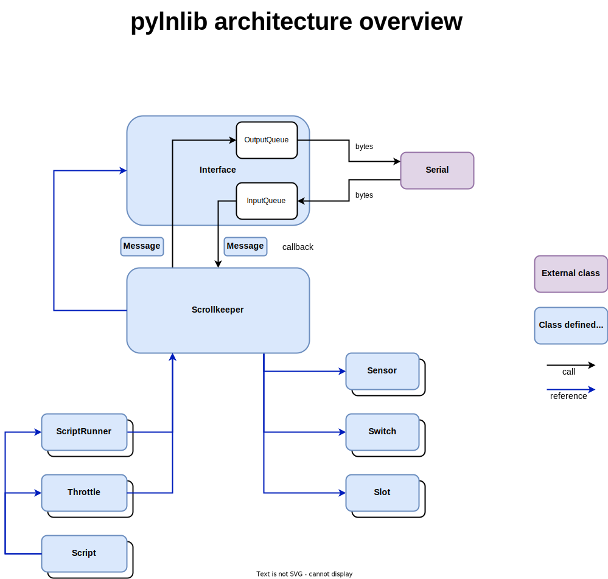

# pylnlib
A python library to monitor LocoNet traffic on a usb/serial bus.

# table of contents
- [intro](#intro)
- [goals](#goals)
- [architecture](#architecture)
  - [Message and Interface classes](#message-and-interface-classes)
  - [The Scrollkeeper class](the-scrollkeeper-class)
  - [The Script and Throttle classes](#the-script-and-throttle-classes)
  - [The Sensor, Switch and Slot classes](the-sensor,-switch-and-slot-classes)
- [dependencies](#dependencies)
- [installation](#installation)
- [example programs](#example-programs)
- [capture and replay](#capture-and-replay)

# intro
I am automating my layout with several [Digikeijs](https://www.digikeijs.com) components ([DR5000](https://www.digikeijs.com/en/digital-model-railway-accessories/command-stations.html), [DR4024](https://www.digikeijs.com/en/dr4024-4-channel-servodecoder-with-4-additional-switching-outputs.html), [DR4088CS](https://www.digikeijs.com/en/dr4088cs-16-channel-feedback-module-s88n.html)) and I want to be able to script part of the running operation.

Now [JMRI](https://github.com/JMRI/JMRI) works fine and even allows for Python scripting, but I find it a bit top heavy on a RaspberryPi 3B+ and also, although this may be a matter of taste, the Python bindings are not very pythonic nor very logical IMHO.

Still, a lot of effort went into JMRI and otherwise it is a fine piece of software, but writing my own LocoNet Python library from scratch is not only a nice personal learning experience, but also might allow me to move some of it to microcontrollers with micro Python.

# goals
The functional goals for `pylnlib` are
- be able to monitor all traffic on the usb loconet buffer interface of the DR5000
  this includes some extensions like the extended function messages (opcodes a3 and d4) generated by many throttles.
  to this end classes are provided that represent most messages as well as an `UnknownMessage` class for messages we do not recognize yet, or are not interested in (like those for CV programming for example)
- be able to control switches and locomotives
  generate messages to change the state of a switch and to change the speed, diection and decoder function of a locomotive.
 - provide a `Script` object that simplifies the automated operation of switches and locomotives.
 
## non goals and scope
There are currently no plans to implement any CV programming options nor do we aim for completeness in controlling locomotives. For example, no functionality is provided to control 'consists'.


# architecture

Pylnlib is designed around the `Message` and `Interface` classes.

## Message and Interface classes
`Message` is subclassed for every implemented LocoNet message (a.k.a. opcode) and `Interface` communicates over a pyserial interface with the command station. `Interface` converts incoming raw bytes to (subclasses of) `Message` instances and converts outgoing `Message` instance to raw bytes.

`Interface` is thread safe and manages all input and output through two queues.

Other class instances, like the `Scrollkeeper`, can register a callback with an instance of an `Interface` that will be called for every incoming message.



## The Scrollkeeper class
The `Scrollkeeper` class is designed to keep track of the layout status. It does this by registering a callback function with an instance of `Interface` and look at every incoming `Message` for changes in the status of sensors, switches and slots.

Status reply messages are used to update information about the item, just like commands. However if a command (like throwing a switch or changing the contents of a slot to change a locomotive's speed) references an unknown item, the `Scrollkeeper` instance will send an appropriate status request message. The reply to this message will then be processed as normal.

For any item it receieves information about (a sensor, switch, or slot) it creates or updates a suitable object in one of the collections it manages.

The `Scrollkeeper` class also offers methods to provide information about the status of the items it keeps updated and to forward an outgoing `Message` to an `Interface`.

The `Scrollkeeper` class is also thread safe, so a single instance could provide information to multiple instances od a `Script`. Thread safety is maintained by locks on the collections of slots, switches and sensors.

## The Script and Throttle classes
The `Script` class is used to automate operations on a layout.

It holds a reference to a `Scrollkeeper` instance and provides methods to change locomotive speed, direction and functions, throw swithces as well as wait for a sensor to change to a certain state.

The `Throttle` class is a utility class that encapsulates control of a single locomotive

It is instantiated by calling a factory function in the `Script` class. Instantiation will also reserve a slot for the locomotive if this is not present yet and establish control by issueing a null move on that slot.

## The Sensor, Switch and Slot classes

The `Scrollkeeper` class maintains several colections of objects that represent the state of an automated object.

The `Sensor` and `Switch` objects are fairly simple and represent on/off and thrown/closed states respectively.

The `Slot` object is a little more complicated as it carries much more information. It represents a slot on the active LocoNet 'stack'. In the LocoNet model you do not address locomotives directly but instead a collection of slots is kept that contains the current information about locomotives. The command station uses this information the repeatedly send DCC messages to the track.

One of the pieces of information in a slot is the decoder address of the locomotiv. Other information that is kept is the diection, speed and the state of the first 9 decoder functions. The `Slot` class extends this by also storing the state of decoder functions 10 and up.

# dependencies
- Python 3.8
- [pyserial](https://github.com/pyserial/pyserial)

# installation
TODO

# example programs
A simple monitor program can be run directly
```bash
python –m pylnlib
```
this program can also capture and store the network data to a file and replay this file. For more optionsntype
```bash
python -m pylnlib --help
```

The scripts directory also contains sample programs that use the library and automate some activities.

# capture and replay

The `pylnlib` library can also capture raw LocoNet bytes and store it for later replay in a file.

This can be really helpful when developing scripts. More details can be found here [capture_and_replay.md](docs/capture_and_replay.md)

