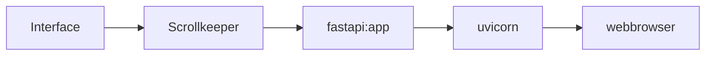

# webserver

The idea is that it should be easy to create a webserver that serves realtime information on the layout status.

With the use of the Scrollkeeper class we already have everything we need to keep the status up to date, so we just have to add some frontend.

# a web frontend

The frontend needs to be able to serve a few static pages but also to provide status info.

Status info can be provided easily by implementing a small REST API for example but what we really want is to push the data as soon as something in the lsyout status is different.

Fortunately all these requirements can be met with [fastapi](https://github.com/tiangolo/fastapi)
that not just enables use to create REST functionality in a really simple way, but also allows serving static pages
and more importantly, can implement web sockets.

# experiments

A tiny [sample implementation](https://github.com/varkenvarken/pylnlib/blob/master/webserver/main.py) is a starting point for further enhancements.

It serves a webpage that will open a websocket. This websocket periodically sends a list of known sensor ids.

