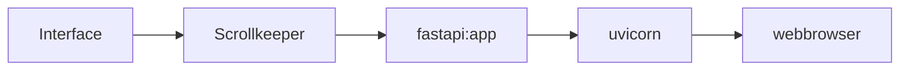

# webserver

The idea is that it should be easy to create a webserver that serves realtime information on the layout status.

With the use of the Scrollkeeper class we already have everything we need to keep the status up to date, so we just have to add some frontend.

# a web frontend

The frontend needs to be able to serve a few static pages but also to provide status info.

Status info can be provided easily by implementing a small REST API for example but what we really want is to push the data as soon as something in the lsyout status is different.

Fortunately all these requirements can be met with [fastapi](https://github.com/tiangolo/fastapi)
that not just enables use to create REST functionality in a really simple way, but also allows serving static pages
and more importantly, can implement web sockets.



# experiments

A tiny [sample implementation](https://github.com/varkenvarken/pylnlib/blob/master/pylnlib/Webserver.py) is a starting point for further enhancements.

It serves a webpage that will open a websocket. This websocket periodically sends an object with lists of slots, sensors and switches,
and the webpage then shows this data every time it gets refreshed.

If you have installed the package with the webserver dependencies like

```bash
pip install pylnlib[webserver]
```

you can run this sample implementation: 

```bash
uvicorn pylnlib.Webserver:app --port 8081 --host 192.168.0.163
```

The example will run a server listening on http://192.168.0.163:8081, where of course
you should use an ipaddress (or hostname) and port suitable for wherever you host the server.

!!! note

    The defaults for this app should work out of the box on a rapberrypi where
    the serial interface presented by the DR5000 over usb is `/dev/ttyACM0`,
    but most aspects can  be controlled by setting environment variables (because
    uvicorn does not provide facilities to forward commandline options to the app
    it calls)
## Environment variables

|variable           | default         |
--------------------|------------------
|PYLNLIB_PORT       |/dev/ttyACM0     | 
|PYLNLIB_BAUD       |57600            |
|PYLNLIB_CAPTURE    |False            |
|PYLNLIB_DUMMY      |False            |
|PYLNLIB_TIMESTAMP  |False            |
|PYLNLIB_LOG        |False            |
|PYLNLIB_REPLAY     |False            |
|PYLNLIB_FAST       |False            |
|PYLNLIB_CAPTUREFILE|pylnlib.capture  |
|PYLNLIB_PORT       |/dev/ttyACM0     |
